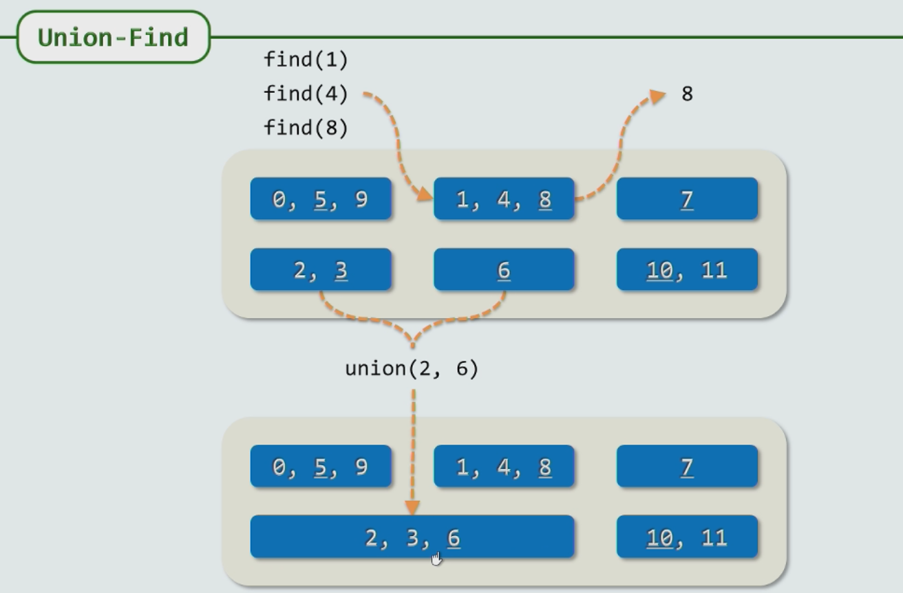
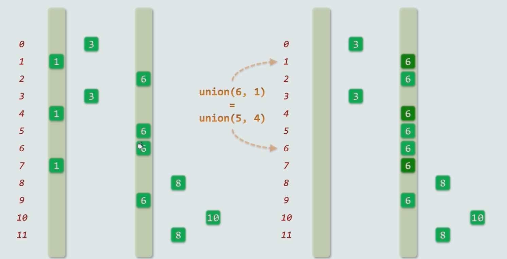
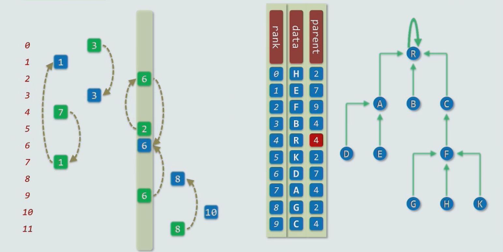

# 第一课-贪心

[TOC]

## 插入排序

- 假设序列里所有的元素都已经排好，如果没有，将关注的这个和前一个交换，关注点放在前一个上，如果仍然逆序，继续交换。

- 改进：直接跳到第一次交换时关注位置的下一个

- 算法实现

  ```
  naiveGnomesort(S[],n)
  	for(int i = 1;i<n;;)
  		if(i<1||S[i-1]<=S[i]) //Greedy
  			i++;
  		else
          	swap(S[i-1],S[i]); //查看上一个位置是否有序
          	i--;
          	
  improvedGnomesort(S[],n)
  	fot(int k = 1;k<n;k++) //记录最后的位置
  		for(int i = k;0<i && S[i-1]>S[i];i--)
  			swap(S[i-1],S[i]);
```
  
  

## 起泡排序

- 假设有序，出现逆序对就交换，来n遍

- 问题：真正有效的是最大的元素出现时，它之后和任何元素都会交换

- 改进：考虑没有n遍就出现有序的情况，用一个sorted记录。或者返回最后一个交换的位置，可能进行i次扫描有大于i个元素已经归位，跳过这i个元素。注意当下标从0开始时，第k个元素前面有k个元素。

- 代码实现

  ```c++
  template <typename T> Rank Vector<T>::bubbleSort(Rank lo,Rank hi){
      while(lo<(hi=bubble(lo,hi)));}
  }
  template <typename T> Rank Vector<T>::bubble(Rank lo,Rank hi){
      Rank last = lo;
      while(++lo<hi)
          if(_elem[lo-1] > _elem[lo]){
              last = lo;
              swap(_elem[lo-1],_elem[lo]);
          }
      return last
  }
  ```

  

## 哈夫曼编码

用二叉树编码，走左子树为0，走右子树为1。哈夫曼编码则时考虑到频率高的字母应该在高处，所以每次合并两株权重最小的子树向上合并，合并的子树权重为原来两子树权重之和。

其他思路：使用树结构复杂度为n^2，如果使用一个栈和一个队列，可以缩减到nlogn。使用栈和队列时，最多只需要考虑栈中最大的两个元素和队列中两个元素。

## 最小生成树

一个有 n 个结点的[连通图](https://baike.baidu.com/item/连通图/6460995)的生成树是原图的极小连通子图，且包含原图中的所有 n 个结点，并且有保持图连通的最少的边。[1]  最小生成树可以用[kruskal](https://baike.baidu.com/item/kruskal/10242089)（克鲁斯卡尔）算法或[prim](https://baike.baidu.com/item/prim/10242166)（普里姆）算法求出。简单的说，就是连接所有节点的边是原图权重最小的边构成的数，如建立几个城市之间的交通问题。

### 1. Prim算法

贪心算法，从任意一个节点开始，逐步蚕食剩余部分，每次都选那条权重最小的边，直到连接了所有的点（选取了n-1条边）。

### 2. kruskal算法

- 先对边排序，第1，2最短的边必定采用，从第三条边开始只要避免出现环一律来用，直到选取了n-1条边。

- 算法的核心是如何判断环路，即如何判断某条边是否连接的是同一棵树。

  采用**并查集**数据结构可以较好的解决这个问题。使用find()判断是否在同一颗树中，使用union合并两棵树。

  

- #### 并查集

  使用向量实现并查集

  ##### find是O(1),union是O(n)

  

  

  ##### 使用链表实现类似树的形式，find是O(logn),union是O(logn)

  

  》还有可以优化的地方，即压缩，将find()变成动态操作，查询某个节点时，顺次将一路向上的节点都归到根节点下(这个结构要求一个矮胖的树，不是经常用的二叉树)