# PyQt5入门

[TOC]

## 安装

Anaconda自带，可以使用`pip install pyqt5`安装

Mac安装了Anaconda之后就有QtDesigner了，路径在`/Users/zhangweizhen/anaconda3`下不用安装Qtß。

## 入门

使用`import PyQt5`导入，要创建基于PyQt5的桌面应用程序，需要使用PyQt5.QtWidget下的QApplication和QWidget

### 1.  使用QtDesigner设置界面，保存成`.ui`文件

### 2. 将.ui文件转成.py文件

#### (1).方法一：命令行

```bash
$ python -m PyQt5.uic.pyuic demo.ui -o demo.py
```

#### (2).方法二:将命令加到Pycharm扩展工具中

#### Windows下：

##### Programe

`C:\ProgramData\Anaconda3\python.exe`

##### Arguments

`python -m PyQt5.uic.pyuic $FileName$ -o $FileNameWithoutExtension$.py`

##### Working directory

`$FileDir$`

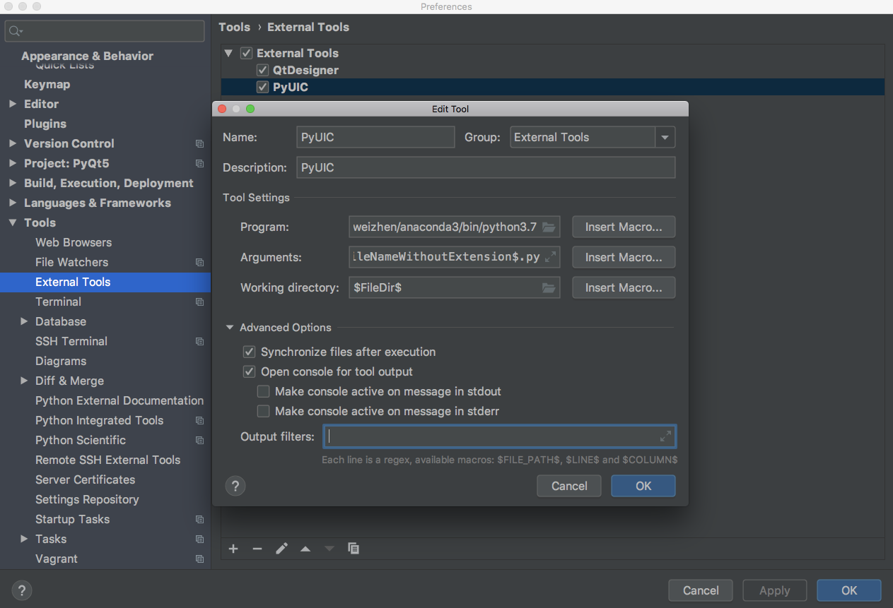

##### 生成的`.py`文件

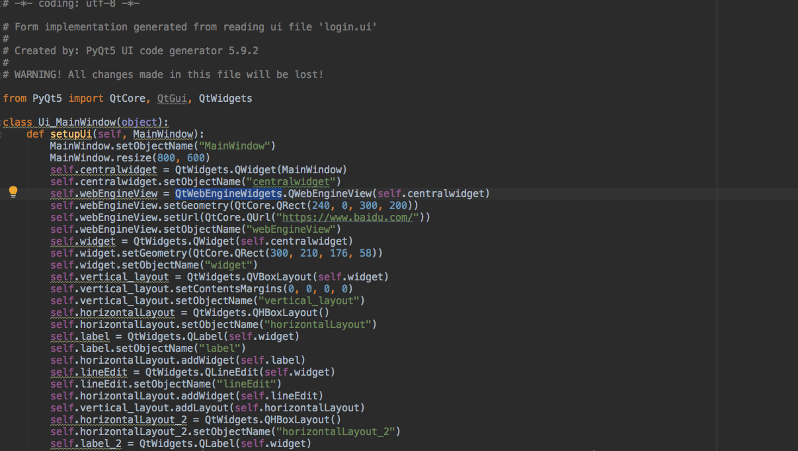

#### Mac下

配置为

##### Program

`/Users/zhangweizhen/anaconda3/bin/Designer.app`

##### Arguments

空

##### Working directory

`$ProjectFileDir$`

### 3. 第一个PyQt程序

```python
import sys
from PyQt5.QtWidgets import QMainWindow, QApplication


if __name__ == '__main__':

    app = QApplication(sys.argv)
    w = QMainWindow()
    w.resize(300,200)
    w.show()
    sys.exit(app.exec_())
```

最后进入了应用的主循环中，事件处理器这个时候开始工作。主循环从窗口上接收事件，并把事件传入到派发到应用控件里。当调用`exit()`方法或直接销毁主控件时，主循环就会结束。`sys.exit()`方法能确保主循环安全退出。外部环境能通知主控件怎么结束。

`exec_()`之所以有个下划线，是因为`exec`是一个Python的关键字。

### 4. 使用UI文件

#### 在QtDesigner中设计界面

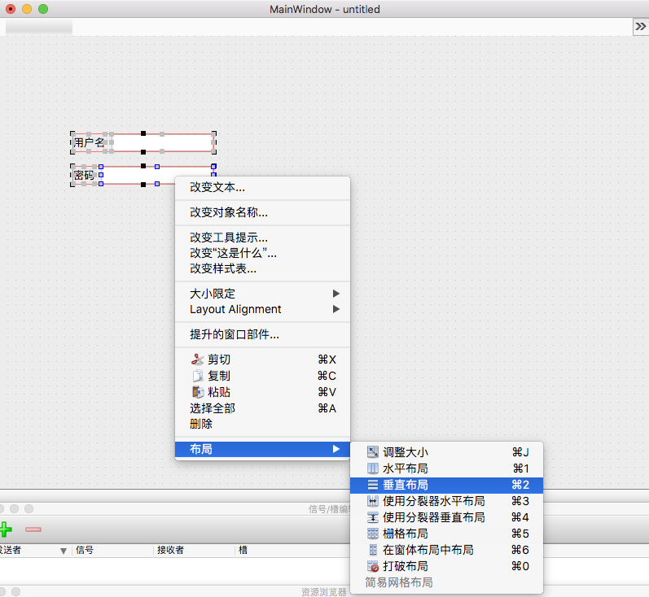

#### 将QtDesigner导出的UI文件转换为`.py`文件后，示例文件如下

```python
import sys
import login

from PyQt5.QtWidgets import QApplication,QMainWindow

if __name__ == '__main__':
    app = QApplication(sys.argv)
    mainWindow = QMainWindow()
    ui = login.Ui_MainWindow()
    ui.setupUi(mainWindow)
    mainWindow.show()
    sys.exit(app.exec_())
```

## 概念

### 1. 尺寸策略

#### 期望尺寸

sizeHint:推荐的尺寸，大部分控件的期望尺寸是只读的

```python
self.pushBuuton.sizeHint().width() //77
self.pushBuuton.sizeHint().height() //32
```

#### 最小期望尺寸

很多控件最小期望尺寸和期望尺寸一样

```
self.pushButton.minimumSizeHint().width()
self.pushButton.minimumSizeHint().height()
```

#### 设置尺寸策略

常用的就是expanding,通过设置"水平伸展"权重来控制其占大小

若是fixed，则默认为期望尺寸，可以通过max和min控制大小。

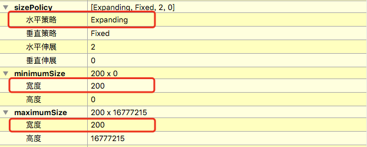

若是Minimum或Maximum，则表示最小/最大为期望尺寸。

### 2.窗口类型

QMainWidget：有标题栏、菜单栏、工具栏、状态栏，最常见的窗口形式。

QDialog：无菜单栏、工具栏、状态栏。

QWidget：不知道窗口的用途时使用。

## QtDesigner使用

### 1. 伙伴的设置

经常可以看到点击标签，输入框获得焦点，或者点击文本RadioButton被选中。在QtDesigner中使用编辑伙伴功能。

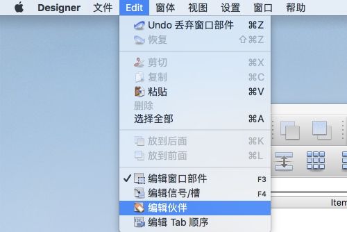

通过拖拽的方式绑定

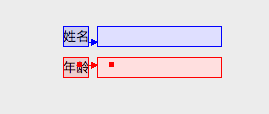

然后返回

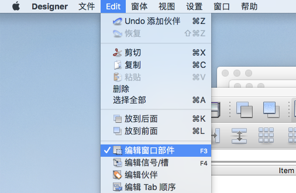

### 2. 编辑Tab顺序

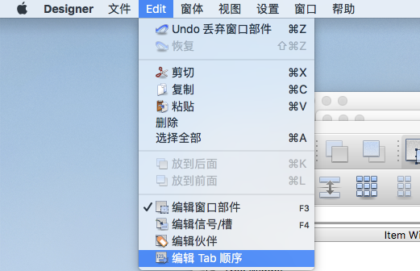

直接双击或者右键制表符顺序列表

### 3. 信号与槽

Qt中的信号与槽机制与事件很相似。信号就是事件，槽就是事件处理函数。

信号与槽是多对多的。使用QtDesigner可视化设置信号与槽如下

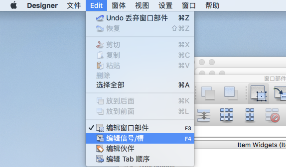

拖拽控件弹出信号与槽编辑框

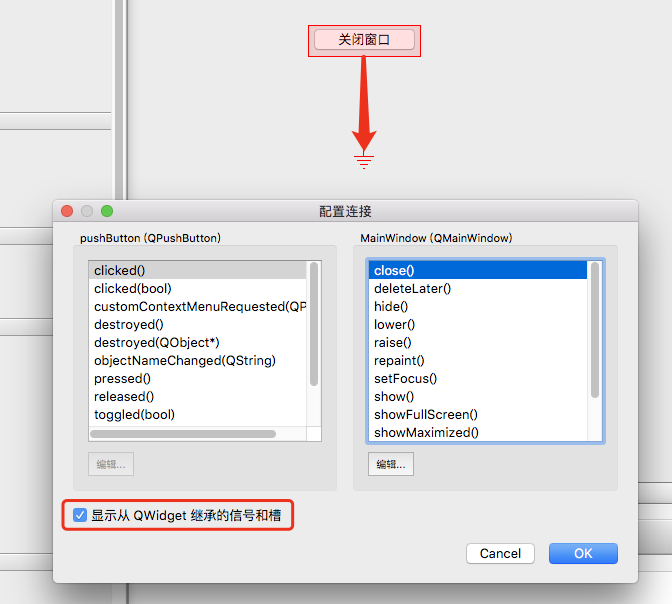

从一个控件指向另一个控件设置信号与槽的信号发出者和订阅者

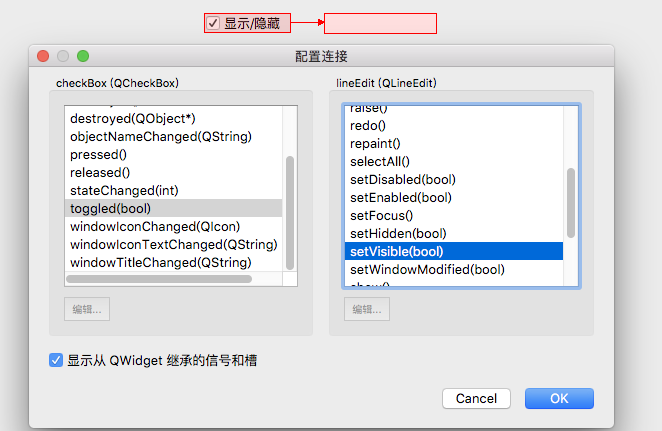

### 4 .MainWindow

默认有菜单栏和状态栏，可以右键添加工具栏

菜单栏和工具栏上的选项并不是控件，而是action，需要使用动作编辑器来编辑。动作编辑器中的动作可以直接拖到菜单栏或工具栏上(两者的action是可以共用的)。在新建action的时候名称不能输入中文，但是设置时可以在动作编辑器中"文本"中设置中文文本。

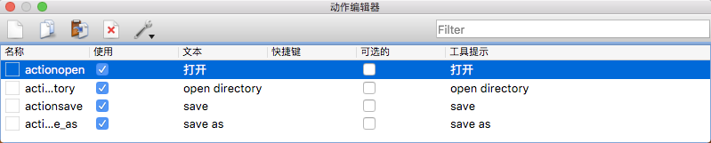

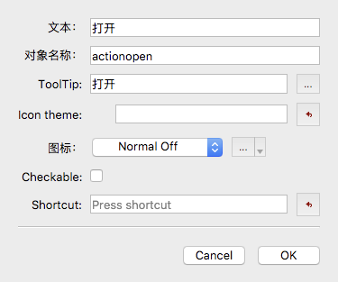

## 窗口组件

### 1. 使用代码生成Window

```python
import sys
from PyQt5.QtWidgets import QMainWindow, QApplication
from PyQt5.QtGui import QIcon


class MainWindow(QMainWindow):
    def __init__(self, parent=None):
        super(MainWindow, self).__init__(parent)

        self.setWindowTitle("主窗口")
        self.resize(1280, 720)
        self.status = self.statusBar()
        self.status.showMessage("只存在5秒的消息", 5000)


if __name__ == '__main__':
    app = QApplication(sys.argv)
    app.setWindowIcon(QIcon("./app.icns"))
    main = MainWindow()
    main.show()

    sys.exit(app.exec_())
```

### 2. 窗口居中

需要获取屏幕和窗口的尺寸

```
# 通过geometry获得工作区参数
screen = QDesktopWidget.screenGeometry()
size = self.geometry()
self.move((screen.width() - size.width())//2, (screen.height() - size.height())//2)
```

### 3. 代码实现信号与槽的连接以及布局

连接是通过信号函数的connect函数连接，可以使用lambda表达式

```python
import sys
from PyQt5.QtWidgets import QMainWindow, QApplication, QDesktopWidget, QPushButton, QWidget, QHBoxLayout
from PyQt5.QtGui import QIcon


class MainWindow(QMainWindow):
    def __init__(self, parent=None):
        super(MainWindow, self).__init__(parent)

        self.setWindowTitle("主窗口")
        self.resize(1280, 720)

        self.button1 = QPushButton("退出")
        self.button1.clicked.connect(self.close)

        layout = QHBoxLayout()
        layout.addWidget(self.button1)

        mainFrame = QWidget()
        mainFrame.setLayout(layout)

        self.setCentralWidget(mainFrame)

    def center(self):
        screen = QDesktopWidget.screenGeometry()
        size = self.geometry()
        self.move((screen.width() - size.width()) // 2, (screen.height() - size.height()) // 2)


if __name__ == '__main__':
    app = QApplication(sys.argv)
    app.setWindowIcon(QIcon("./app.icns"))
    main = MainWindow()
    main.show()

    sys.exit(app.exec_()
```

> 和在QtDesigner中一样，一个主窗口有一个大QWidget作为主容器，容器里通过布局放置控件

### 4. 窗口坐标系

 坐标原点在屏幕左上角。

```python
# 坐标系参数，不包含标题栏
screen = QDesktopWidget.screenGeometry()
size = self.geometry()

# 窗口参数，move设置的就是这些值
widget.x()
widget.width()
widget.height()

# 获得包含标题栏高度的框架参数
widget.frameGeometry().height()
```

#### 通过坐标系同时设定窗口的位置和大小

```python
window.setGeometry(300,300,250,250)
```

## 事件

和其他GUI一样通过重写方法实现。

如拖拽事件

```python
def dragEnterEvent(self,e):
    print(e)
```

## 信号与槽

### 1. 自定义信号

#### 定义信号

实例化pyqtSignal类并使用emit发送即可

```python
from PyQt5 import *
class MyTypeSignal(QObject):
    sendmsg = pyqtSignal(object)
    
  def run(self):
    self.sendmsg.emit("Hello!")
```

#### 发送信号

直接调用

```python
sender = MyTypeSignal()
sender.run()
```


### 2. 槽函数

使用实例化的pyqtSignal对象连接。

```python
sender.sendmsg.connect(reciver.slot)
self.button1.clicked.connect(labmda:print("Hello!"))
```

断开将connect换成disconnet即可。

## 常用API

### 1. 坐标相关

- resize()
- move()
- setGeometry()

### 2. 设置标题和图标

- setWindowTitle()

- setWindowIcon(Icon("./image/base.ico"))

  > 窗口的setWindowIcon方法用于设定窗口的图标，Windows中可用。
  >
  > QApplication中的setWindowIcon方法用于设置主窗口的图标和应用程序图标，但调用了窗口的setWindowIcon方法，就只能显示应用程序的图标了

### 3. 添加提示信息

- QToolTip
  - [窗口/控件].setToolTip("\<b>天气\</b>真好啊")
  - QToolTip.setFont(QFont("SansSerif",12))

### 4. 弹出消息对话框

```
ui.pushButton.clicked.connect(lambda:QMessageBox.information(w,"提示","你点击了按钮!"))
```

- information
- about
- war

### 5. 文件对话框

使用静态方法`QFileDialog.getOpenFileName()`

```python
file_name = QFileDialog.getOpenFileName(w,"打开",".","UI文件 (*.ui)")
```

## 打包

### 使用**Pyinstaller**进行打包

```bash
$ pyinstaller -F -w main.py
```

> 如果出现错误
>
> Exception:             Cannot find existing PyQt5 plugin directories             Paths checked: C:/qt64/qt_1544645195969/_h_env/Library/plugins
>
> 可能是由于conda的缘故，可以使用`pip install PyQt5`的方式解决